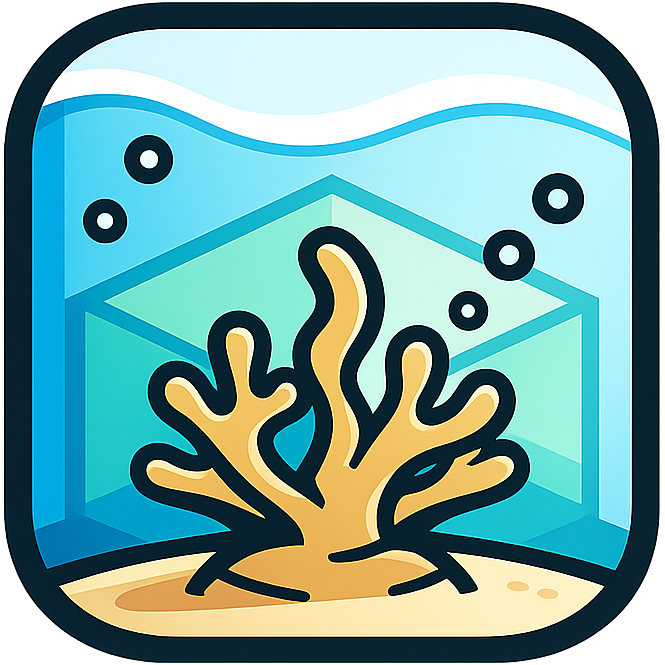
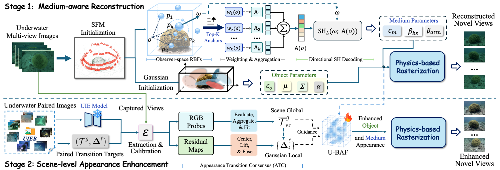

<div align="center">

<h1> 3D-USE: From Image-Level to Scene-Level Underwater Enhancement</h1>

<p>
  <a href="https://jieyu-yuan.github.io/">Jieyu Yuan<sup>1</sup></a> &middot;
  <a href="https://c-pupil.github.io/">Yuanlin Zhang<sup>1</sup></a> &middot;
  <a href="https://github.com/JoongLeo">Jihong Li<sup>1</sup></a> &middot;
  <a href="https://guochunle-zero.github.io/">Chunle Guo<sup>1,2</sup></a> &middot;
  <a href="https://scholar.google.com.hk/citations?user=IuME_8AAAAAJ&amp;hl=en">Huimin Lu<sup>3,4</sup></a> &middot;
  <a href="https://li-chongyi.github.io/">Chongyi Li<sup>1,2,*</sup></a>
</p>

<p>
  <sup>1</sup>Nankai University &nbsp;&nbsp;
  <sup>2</sup>NKIARI, Shenzhen Futian<br>
  <sup>3</sup>Southeast University &nbsp;&nbsp;
  <sup>4</sup>Advanced Ocean Institute of Southeast University, Nantong<br>
  <sup>*</sup>Corresponding author
</p>

<p>
  <a href="https://arxiv.org/abs/2608.28020"></a>
  <a href="https://bilityniu.github.io/3D-USE/"></a>
  <a href="https://github.com/bilityniu/3D-USE"></a>
</p>

</div>

---

## 📰 News

- **[2026.09.01]** Code repository is now available! [[Code](https://github.com/bilityniu/3D-USE)]
- **[2026.08.28]** Paper released on arXiv! [[arXiv](https://arxiv.org/abs/2608.28020)]

## 🌊 Overview

3D-USE aims to reconstruct an underwater scene with improved visibility and consistent appearance across novel viewpoints. Standard reconstruction preserves underwater degradation, while independent 2D enhancement can introduce view-dependent corrections. Our two-stage framework first builds a medium-aware Gaussian scene and then transfers paired 2D enhancement knowledge into a persistent 3D appearance representation, enabling enhanced novel-view rendering without a 2D UIE model at inference.

- **Stage 1:** Medium-aware Gaussian reconstruction with MediumRBF.
- **Stage 2:** ATC-guided scene enhancement stored in U-BAF.
- **Inference:** Enhanced novel-view rendering without a 2D UIE model.

<p align="center">
  
</p>

## 🛠️ Installation

```bash
git clone https://github.com/bilityniu/3D-USE.git
cd 3D-USE

conda env create -f environment/environment.yml
conda activate 3duse
bash environment/install.sh
```

## 📂 Data

Each scene contains COLMAP data and one Depth Anything V2 pseudo-depth map per image:

```text
SCENE/
|-- images_wb/
|-- colmap/sparse/0/
`-- depth/
```

Generate pseudo-depth from the COLMAP input images:

```bash
python scripts/generate_da2_pseudodepth.py \
  --images /path/to/SCENE/images_wb \
  --output /path/to/SCENE/depth \
  --checkpoint /path/to/depth_anything_v2_vitl.pth \
  --da2-repo /path/to/Depth-Anything-V2
```

Image and depth filenames must have matching stems. Model weights are provided separately.

## 📦 Pretrained Models

| Model | Role | Download |
|---|---|---|
| Depth Anything V2 | Generates the monocular pseudo-depth used in Stage 1 | [Upstream release](https://github.com/DepthAnything/Depth-Anything-V2) |
| UIE proposer | Produces frozen view-wise proposals for ATC target construction | [Download](weights/uie_proposer.pth) |
| Transition calibrator | Maps proposal transitions into the paired-data transition domain | [Download](weights/transition_calibrator.pth) |

The released proposer and calibrator can be used directly. See [docs/TRAINING.md](docs/TRAINING.md) to prepare paired transition data and retrain the calibrator.

## 🚀 Training

```bash
bash recipes/run_two_stage.sh \
  --data /path/to/SCENE \
  --output /path/to/outputs/SCENE \
  --calibrator weights/transition_calibrator.pth \
  --uie-proposer weights/uie_proposer.pth
```

Direct interfaces: `ns-train 3duse-stage1 --help` and `ns-train 3duse-stage2 --help`.

## 🎥 Rendering and Evaluation

```bash
ns-render dataset \
  --load-config /path/to/stage2/config.yml \
  --output-path /path/to/renders/test \
  --split test \
  --rendered-output-names stage1_rgb enhanced_rgb
```

```bash
ns-eval \
  --load-config /path/to/stage1/config.yml \
  --output-path /path/to/reconstruction_metrics.json
```

Outputs include reconstruction, object, medium, depth, and enhanced branches.

Render a camera-path video:

```bash
ns-render camera-path \
  --load-config /path/to/stage2/config.yml \
  --camera-path-filename /path/to/camera_path.json \
  --output-path /path/to/enhanced.mp4 \
  --rendered-output-names enhanced_rgb
```

## 📖 Citation

```bibtex
@article{yuan2026three_duse,
  title={3D-USE: From Image-Level to Scene-Level Underwater Enhancement},
  author={Yuan, Jieyu and Zhang, Yuanlin and Li, Jihong and Guo, Chun-Le and Lu, Huimin and Li, Chongyi},
  journal={arXiv preprint arXiv:2608.28020},
  year={2026},
  eprint={2608.28020},
  archivePrefix={arXiv},
  primaryClass={cs.CV},
  url={https://arxiv.org/abs/2608.28020}
}
```

## 🤝 Acknowledgements

3D-USE builds on [Nerfstudio](https://github.com/nerfstudio-project/nerfstudio), [gsplat](https://github.com/nerfstudio-project/gsplat), [Plenodium](https://github.com/cgwu1999/plenodium), and [WaterSplatting](https://github.com/water-splatting/water-splatting). The UIE proposer architecture follows [UnderwaterRanker](https://github.com/RQ-Wu/UnderwaterRanker), and pseudo-depth is generated with [Depth Anything V2](https://github.com/DepthAnything/Depth-Anything-V2). We thank the authors for making their work publicly available.

## 📜 License

Original 3D-USE contributions are released under the [Pi-Lab License 1.0](LICENSE) for non-commercial research use. Third-party components and adapted files retain their original terms.

## 📮 Contact

Feel free to contact us at **jieyuyuan.cn[AT]gmail.com** for any questions or collaborations!
